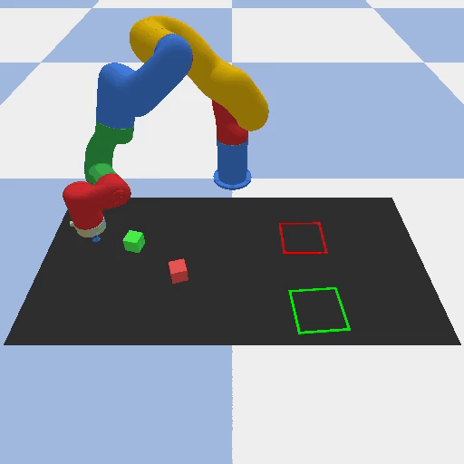

# Sorting via Pushing
The workspace contains multiple objects of two different colors and areas corresponding to those colors. The task is for the robot to push all objects to their corresponding colored areas. The objects can be of different shapes, and the areas should be simple squares with colored borders able to fit all required objects. The objects and the areas should be placed randomly.

<figure>

<figcaption>https://diffusion-policy.cs.columbia.edu/</figcaption>
</figure>

view full Task under ``project\rp_Project_Assignment.pdf``

## Setup environment
In `build_image.sh` choose between
* with graphics-card: `RENDER=nvidia`
* without graphics-card: `RENDER=base`

In `run_container.sh` choose between
* with graphics-card: add line: `--gpus all \`
* without graphics-card: remove line: `--gpus all \`

## Run project
in terminal:
* `./build_image.sh`
* `./run_container.sh`
* `python ./difficult_task.py`